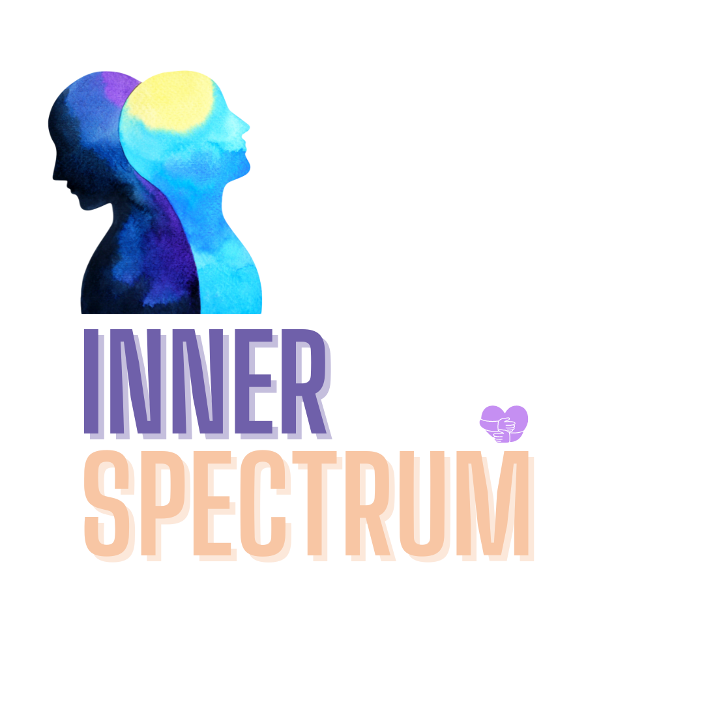

## Inner Spectrum 🫧

Mental health is an important issue in the world today. With a large population now working and staying away from their loved ones, the mental health situation has been deteriorated. It becomes important to look and keep track of this before it gets serious. That's why I built Inner Spectrum App 🪴.
 
 
Keeping in mind that users might be experiencing distress and wouldn't want to engage much with the app, therefore the design of the app is very friendly and welcoming.

### The app's walkthrough can be seen here 🐾:

## Tech Stack used 🔖:
- React Native 🦈
- Firebase 🐋

### Future Aspects ⏳:
This application can be built into a full-fledged health-care app with proper research and a few additions.